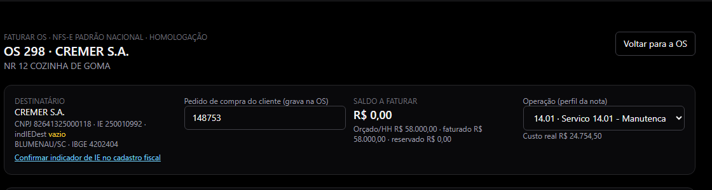
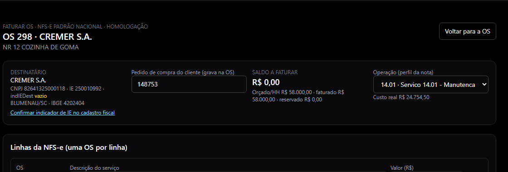
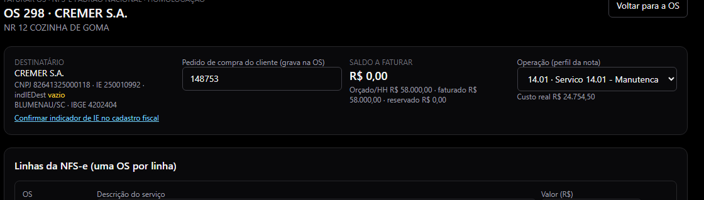
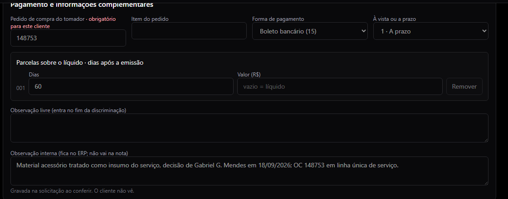
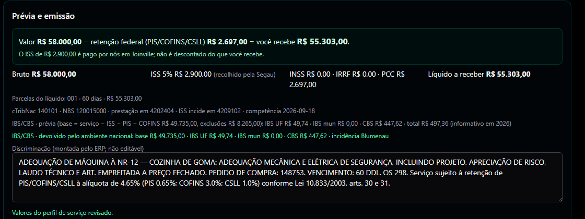
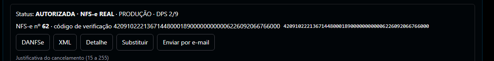

# Faturar serviço (NFS-e) de uma OS — manual da equipe

Onde: **OS › a OS › Faturar › NFS-e**. Telas de 18/09/2026, da OS 298 (CREMER, adequação de máquina à NR-12, R$ 58.000,00 → NFS-e real nº 62). Quem faz: perfil FATURAMENTO, FINANCEIRO ou ADMIN.

Serviço é NFS-e; mercadoria é NF-e. Nesta tela sai **uma nota de serviço** com o valor combinado; o material que a equipe usou na OS entra como **custo**, não como venda — ele não aparece na nota e não baixa estoque de novo.

## 1 · Antes de começar

- O **valor combinado** com o cliente (o orçado da OS) e a **forma de pagamento** (quantos dias).
- O **número do pedido de compra (OC)** do cliente, quando houver. Alguns clientes recusam a nota sem ele — nesses, o campo é obrigatório e a tela avisa.
- O que o cliente vai receber, **em uma frase**: o resultado entregue. Nunca escreva "mão de obra" nem horas: isso muda o enquadramento da nota e o sistema recusa.
- Se o cliente avisou que **vai reter o ISS**. Quando não avisou, quem recolhe é a Segau.

## 2 · Passo a passo

**Passo 1 · Escolher o serviço.** Na OS, botão **Faturar**, aba NFS-e. Em **Operação de serviço** confira o perfil: o sistema mostra o código com a explicação em português (ex.: **14.01 · conserto, manutenção ou adequação de máquina do cliente**). Se o serviço não for esse, troque o perfil no alto da tela.

*O código do serviço vem com a explicação e um exemplo ao lado.*

**Passo 2 · Conferir a linha e o valor.** Em **Linhas da NFS-e**, o valor vem do saldo da OS. Escreva a descrição do serviço: o resultado entregue, sem "mão de obra" e sem horas. O total da linha é o valor da nota.

*Uma linha por OS, com a descrição do resultado e o valor.*

**Passo 3 · Retenções e local.** As retenções vêm da regra do serviço e do cadastro do cliente; você só mexe quando a tela deixa. **ISS retido pelo tomador?** — marque só se o cliente avisou que vai reter, porque isso muda o valor que a Segau recebe. Confira o município da prestação e a competência (mês da emissão).

*Retenções: o que é regra do serviço aparece travado; o ISS retido tem a legenda de quando marcar.*

**Passo 4 · Pagamento, pedido e observações.** Preencha o **pedido de compra do tomador** (obrigatório nos clientes que exigem: a tela marca em vermelho e não deixa conferir sem ele), a forma de pagamento e os **dias** do vencimento. A **observação livre** entra no fim da descrição da nota — o cliente lê. A **observação interna** fica só no ERP.

*Pedido obrigatório, parcela de 60 dias, observação livre (vai na nota) e observação interna (não vai).*

**Passo 5 · Conferir e emitir o ensaio.** Clique em **Salvar rascunho e conferir**. O sistema calcula tudo e mostra a prévia. Confira o quadro verde: **valor − retenções = você recebe**. Depois, **Emitir NFS-e em homologação** — é um ensaio, sem valor fiscal, para o sistema conferir a nota antes da real.

*Prévia: o líquido em destaque, os impostos, o IBS/CBS e a descrição final que vai na nota.*

## 3 · Conferência final (antes da nota real)

Leia em voz alta, com a OC do cliente na mão:

| Confira | Na OS 298 ficou |
| --- | --- |
| Tomador (nome e CNPJ) | CREMER S.A. · 82.641.325/0001-18 |
| Valor da nota | R$ 58.000,00 |
| Você recebe (líquido) | R$ 55.303,00 |
| Retenção do cliente | R$ 2.697,00 (PIS/COFINS/CSLL, 4,65%) |
| ISS | R$ 2.900,00 pago pela Segau em Joinville (não desconta do que recebemos) |
| Vencimento | 60 dias |
| Pedido de compra na descrição | 148753 |
| Descrição | o resultado entregue, sem "mão de obra" e sem horas |

> **A NFS-e não aceita carta de correção de valor nem de retenção.** Errou valor, retenção, tomador ou descrição: só substituindo (nota nova que referencia a errada) ou cancelando — em Joinville, até o último dia do mês em que a nota foi emitida. Por isso a conferência é agora, não depois.

## 4 · A nota real

A nota real só sai depois que o responsável fiscal **liberar o perfil para aquele ensaio**. Com a liberação feita, aparece o botão **Emitir NFS-e real (produção)**. Confirme e espere o retorno: a tela passa a mostrar **AUTORIZADA · NFS-e REAL** com número, código de verificação, DANFSe e XML.

*Nota real autorizada: número, código de verificação e os botões de DANFSe, XML e envio por e-mail.*

Envie ao cliente a **DANFSe** e o **XML** (botão Enviar por e-mail) junto com o boleto do vencimento combinado.

## 5 · O que o sistema faz sozinho depois da nota

- **Contas a receber**: um título com o valor **líquido** (o que o cliente vai pagar), na data do vencimento.
- **Saldo da OS**: o valor faturado entra e o saldo a faturar cai — na OS 298 foi a zero.
- **Arquivos**: DANFSe e XML ficam guardados na nota, para reenviar quando precisar.
- **Marcar a OS como faturada** continua sendo um clique seu, depois de a OS estar concluída.

## 6 · Quando a tela trava (e o que fazer)

| O que aparece | O que fazer |
| --- | --- |
| "Este cliente exige o número do pedido de compra (OC)" | Preencha o campo do pedido. Se o cliente não usa OC, peça ao cadastro para desmarcar a exigência na ficha dele. |
| "MÃO DE OBRA é proibido na descrição" | Descreva o resultado entregue (o que foi adequado, instalado, consertado), não o esforço. |
| "Perfil de serviço precisa estar liberado para esta homologação" | Normal: o ensaio saiu, falta o responsável fiscal liberar o perfil para ele. Chame quem cuida do fiscal. |
| Bloqueios com nome de campo (cadastro do cliente, competência, município) | Cada bloqueio traz o caminho para corrigir. Corrija e clique em Reconferir. |
| "Competência precisa ser no mês da emissão" | Ajuste a competência para o mês em que a nota vai sair. |
| Ensaio REJEITADA | Abra o detalhe, leia o motivo e chame o responsável fiscal. Não tente de novo sem entender. |
