# Retorno de mercadoria de terceiros — manual da equipe de faturamento

Onde: **Faturamento › Operações fora do faturamento › aba RETORNO DE TERCEIROS**. Revisado em 18/09/2026 com as telas da NF-e 908542/1 da WEG Tintas (material aplicado no produto → NF-e de retorno 2/25, emitida em produção). Quem faz: qualquer pessoa com perfil FATURAMENTO, FINANCEIRO ou ADMIN na empresa SEGAU.

| Caso de referência | Dados |
| --- | --- |
| Nota do cliente | NF-e 908542/1 · WEG TINTAS LTDA (Guaramirim/SC) · 03/07/2026 · CFOP 5901 (remessa para industrialização) · 1 item: TINTAS PARA INDUSTRIALIZAÇAO, 12 UN × R$ 72,31 = R$ 867,72 · chave 42260760621141000404550010009085421545851279 |
| O que aconteceu com o material | Foi usado no produto (tinta aplicada) → nota de retorno com CFOP 5902 |
| Ensaio (homologação) | NF-e 2/71 · 18/09/2026 06:43 · autorizada (sem valor fiscal) |
| Nota real (produção) | NF-e 2/25 · 18/09/2026 06:45 · chave 42260913671448000189550020000000251536196350 · protocolo 242260442413978 |
| Resultado no ERP | Remessa RETORNADA · operação RETORNO · CONCLUIDA · nota listada como "Sem cobrança" · nada no estoque, nada no contas a receber |

## 1 · Quando usar

Um cliente manda material para a Segau **usar em um produto dele** (industrialização por encomenda; a nota dele vem com CFOP 5901) ou para **consertar** (5915). O material continua sendo do cliente. Quando o trabalho termina e o material vai embora, a Segau emite a **NF-e de retorno**, que é o espelho da nota que o cliente mandou.

Não é venda e não é devolução: nada entra no estoque, não há cobrança, a nota não aparece no faturado nem no contas a receber. Ela só "fecha" a nota do cliente.

Prazo: o material precisa voltar em até **180 dias** da nota do cliente. A lista mostra os dias e a data limite: verde até 149 dias, amarelo de 150 a 180, vermelho vencido.

> O XML da nota do cliente **nunca** entra por Estoque › Importar XML. Aquela tela recusa e aponta para esta aba.

## 2 · O que ter em mãos

- O **arquivo XML** da nota do cliente (autorizado). O PDF da DANFE não serve para importar; se só veio o PDF, peça o XML ao cliente (no caso da WEG: faturamento@weg.net).
- Saber **o que aconteceu com o material**: foi usado no produto, ou voltou sem usar. "Parte usada, parte devolvida" ainda não está disponível no sistema — nesse caso, chame o responsável fiscal antes de começar.
- Saber **quem paga o frete** do retorno (padrão: a Segau paga).
- A mercadoria (ou o produto pronto) vai sair fisicamente no dia da nota real. A nota real se emite nesse dia, não antes.

## 3 · Passo a passo

**Passo 1 · Abrir a aba.** Faturamento › Operações fora do faturamento › botão **RETORNO DE TERCEIROS**. A aba tem três partes: **1 · Importar remessa recebida (XML)**, **2 · Mercadorias de terceiros em nosso poder** (a lista, com o botão Gerar retorno em cada linha) e **Testes de homologação** (só o responsável fiscal usa; ignore).

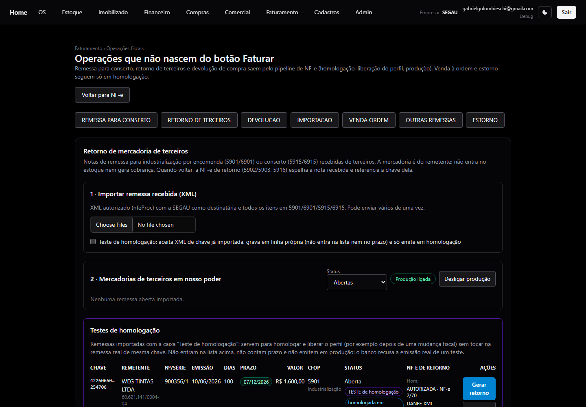

*Aba RETORNO DE TERCEIROS.*

**Passo 2 · Importar o XML da nota do cliente.** Em "1 · Importar remessa recebida (XML)", clique em **Choose Files** e escolha o arquivo (pode escolher vários de uma vez). Deixe **desmarcada** a caixa "Teste de homologação". O sistema confere a nota e mostra o resultado: **importado · WEG TINTAS LTDA · NF-e 908542/1 · Industrialização · 1 item(ns) · R$ 867,72 · retorno até 30/12/2026**. A nota entra na lista como **Aberta**, com o prazo.

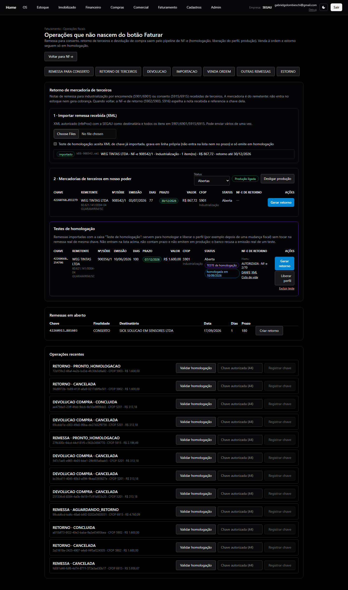

*XML da NF-e 908542/1 importado: linha Aberta, 77 dias, prazo 30/12/2026, R$ 867,72, CFOP 5901 Industrialização.*

Se a tela recusar o arquivo, é por um destes motivos: a nota não é remessa de terceiros (CFOP diferente de 5901/6901/5915/6915), a Segau não é a destinatária, a nota não está autorizada, ou essa chave já foi importada antes. Confira o arquivo; se continuar, chame o responsável fiscal.

**Passo 3 · Gerar o retorno e emitir em homologação (ensaio).** Na linha da nota, clique em **Gerar retorno**. O modal mostra o destinatário (o cliente, como está no XML) e os itens — tudo só leitura, porque a nota de retorno é o espelho da nota do cliente. Responda **"O que aconteceu com o material do cliente?"**: **Foi usado no produto** (ex.: tinta aplicada, peça montada; o sistema usa CFOP 5902) ou **Voltou sem usar** (ex.: lata fechada, sobra devolvida como veio; CFOP 5903). "Parte usada, parte devolvida" fica desabilitada. Escolha quem paga o frete (padrão **Segau paga o frete (CIF)**); os volumes vêm da nota do cliente. A observação é opcional e vai nas informações complementares. Clique em **Emitir em homologação**.

> Homologação é um **ensaio**: a nota vai para o ambiente de teste da SEFAZ e **não tem valor fiscal**. Serve para o sistema conferir a nota antes da emissão real.

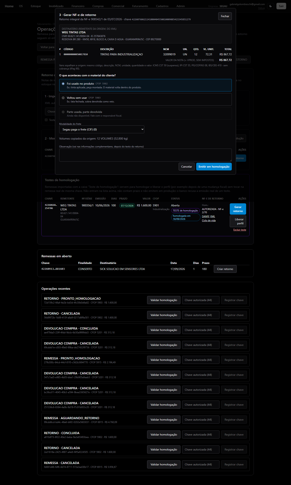

*Modal Gerar NF-e de retorno com "Foi usado no produto" marcado e frete CIF.*

**Passo 4 · Esperar a resposta do ensaio.** A resposta chega sozinha em alguns segundos. A linha passa a mostrar **Hom.: AUTORIZADA · NF-e 2/71**, o selo **homologada em 18/09/2026** e os links DANFE, XML e Ciclo de vida do ensaio. Se aparecer **REJEITADA**, abra o Ciclo de vida para ler o motivo e chame o responsável fiscal; não tente de novo sem saber o motivo. Enquanto a remessa estiver Aberta, **Gerar retorno** pode ser usado de novo (por exemplo, se marcou a opção errada): o ensaio anterior é cancelado.

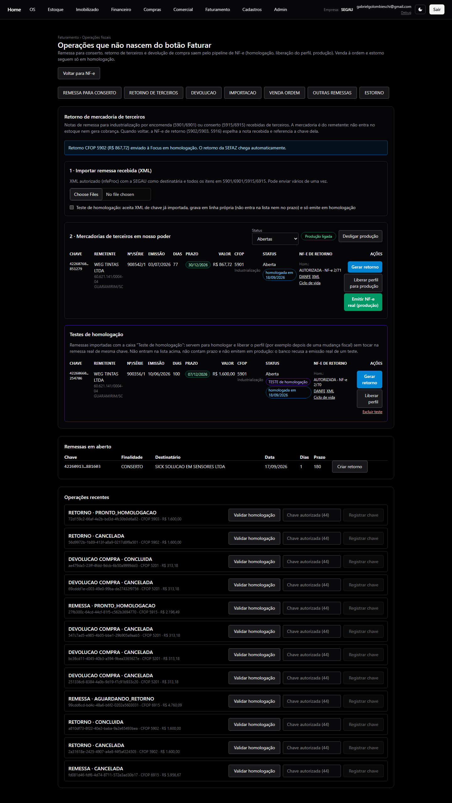

*Ensaio autorizado (NF-e 2/71). Aparecem os botões Liberar perfil para produção e Emitir NF-e real (produção).*

**Passo 5 · Liberar o perfil para esta homologação.** Clique em **Liberar perfil para produção** na linha. Abre a tela de perfis fiscais já com o perfil do retorno e o ensaio preenchidos. Confira o quadro **"Confira se o que está voltando é igual ao que o cliente mandou"**: produto, NCM, quantidade, unidade, valores e chave referenciada — **tudo em cinza = igual**; **qualquer linha em vermelho = pare** e chame o responsável fiscal. Escreva a **justificativa da liberação** (o que você conferiu), marque **"Confirmo a equivalência com esta nota AUTORIZADA em homologação…"** e clique em **Conferir e liberar para esta homologação**. A tela volta para a aba.

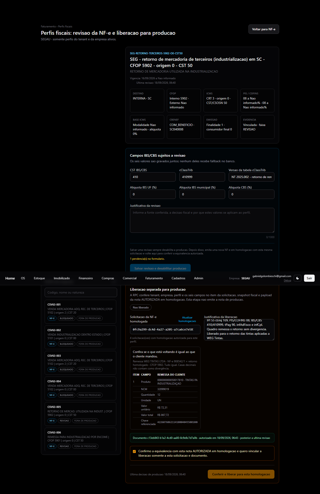

*Tela de perfis: quadro remessa × retorno sem divergência, justificativa e confirmação marcada, botão Conferir e liberar.*

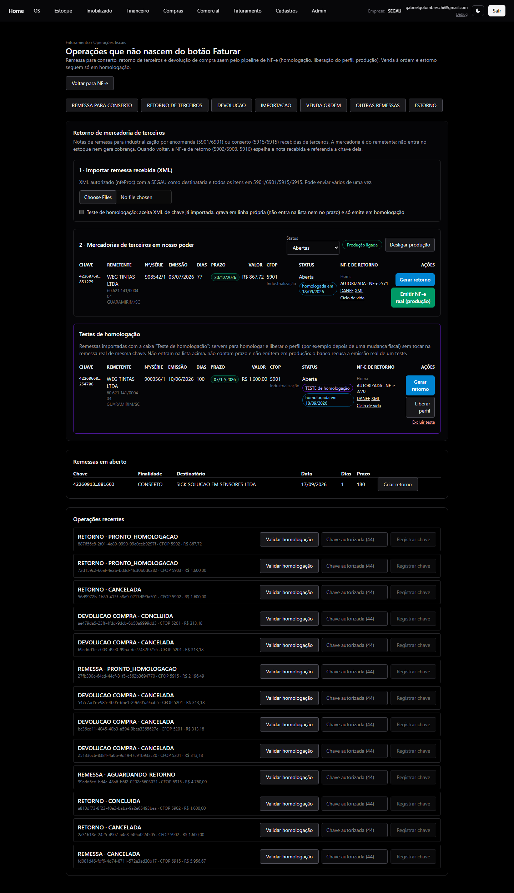

*De volta à aba: a linha agora mostra só Emitir NF-e real (produção).*

Por que essa etapa existe: a liberação vale **só para esta nota**. Cada retorno novo passa por ensaio + liberação de novo. É o controle que impede uma nota real sair diferente do que foi conferido.

**Passo 6 · Emitir a NF-e real (produção).** No dia em que o material for sair, clique em **Emitir NF-e real (produção)**. Leia a confirmação: destinatário, nota de origem, CFOP do retorno, valor e a frase "sem ICMS, IPI, PIS e COFINS · sem cobrança". Ao confirmar, aparece **"NF-e de retorno enviada à SEFAZ em PRODUÇÃO."** e, quando a SEFAZ autoriza, a linha **sai da lista de Abertas**.

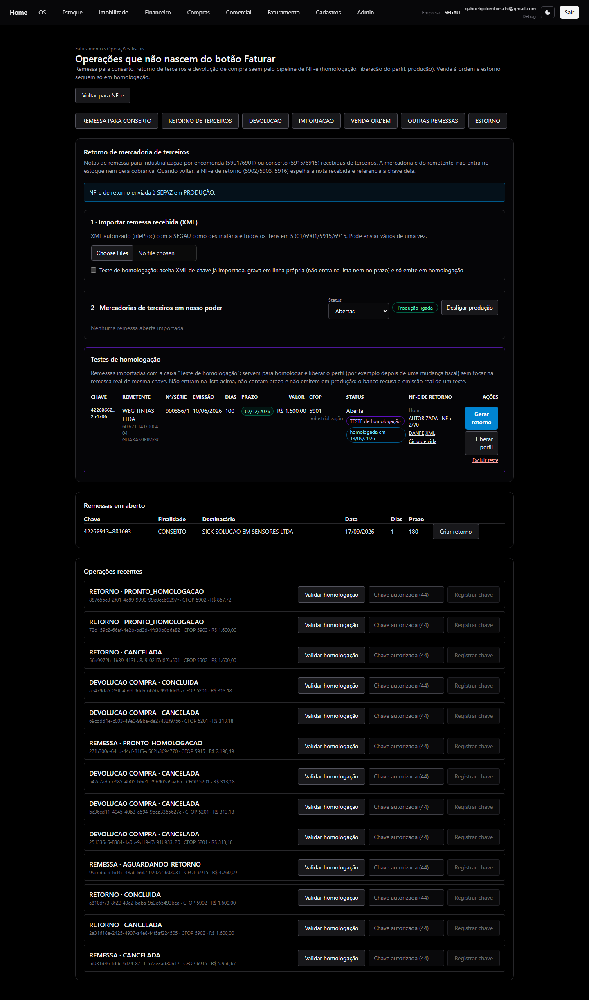

*Depois da confirmação: aviso de envio em produção e a lista de Abertas vazia (a remessa já foi retornada).*

Troque o filtro **Status** para **Retornadas** para ver a linha: **Prod.: AUTORIZADA · NF-e 2/25**, com DANFE, XML e Ciclo de vida da nota real, e o selo **retorno 5902 em 18/09/2026**.

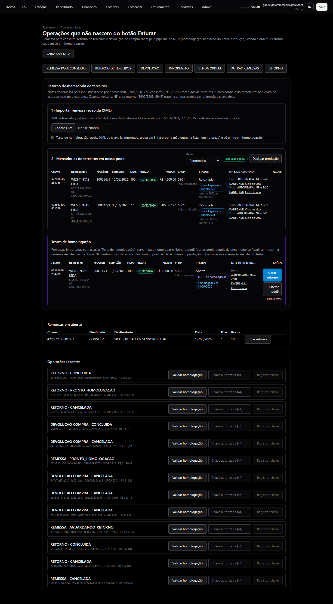

*Filtro Retornadas: a 908542/1 com o ensaio 2/71 e a nota real 2/25 (e, acima, a 900356/1 retornada em 16/09 pela 2/20).*

Se o botão **Emitir NF-e real** não aparecer: (a) a linha mostra "Emissão real desligada para esta aba" → peça a um administrador para ligar a produção; (b) a linha ainda mostra **Liberar perfil para produção** → volte ao passo 5; (c) aparece "perfil precisa ser revisado" → chame o responsável fiscal (o perfil fiscal mudou e precisa de nova revisão).

**Passo 7 · Depois da nota.** Imprima a **DANFE** (botão DANFE ao lado de "Prod.: AUTORIZADA") para acompanhar o material e envie o **XML** ao cliente (botão XML, ou pelo **Ciclo de vida** › enviar por e-mail). Em **Operações recentes**, no fim da página, a operação aparece como **RETORNO · CONCLUIDA**. Em Faturamento › NF-e a nota aparece como **Sem cobrança**, com "A pagar" zerado. Não há nada a fazer no financeiro nem no estoque. Se precisar cancelar (até 24 h, pelo Ciclo de vida, com justificativa), a remessa volta para Aberta e pode gerar retorno de novo.

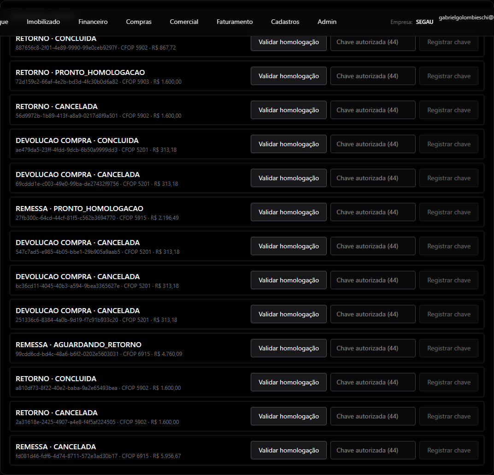

*Operações recentes: RETORNO · CONCLUIDA · CFOP 5902 · R$ 867,72.*

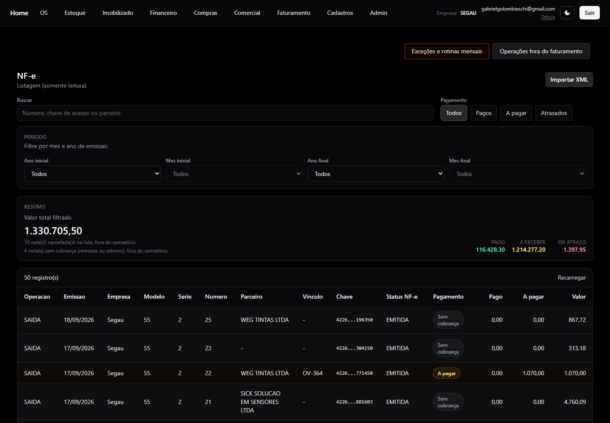

*Lista de NF-e: a 2/25 para WEG TINTAS LTDA como "Sem cobrança", fora do somatório.*

## 4 · O que saiu na nota 2/25 (para conferir na DANFE)

Tudo abaixo vem do sistema (perfil fiscal do retorno). Ninguém digita imposto na hora de emitir. Se a DANFE mostrar algo diferente disso, chame o responsável fiscal antes de entregar.

| Campo | Valor na 2/25 |
| --- | --- |
| Natureza da operação | RETORNO DE MERCADORIA UTILIZADA NA INDUSTRIALIZACAO |
| CFOP | 5902 (cliente em SC). Para cliente de outro estado o sistema usa 6902 sozinho |
| Destinatário | WEG TINTAS LTDA · CNPJ 60.621.141/0004-04 · IE 257843876 · Guaramirim/SC (copiado da nota do cliente) |
| Item | 000000000050017810 · TINTAS PARA INDUSTRIALIZAÇAO · NCM 32099019 · 12 UN × 72,31 = R$ 867,72 (igual à nota do cliente) |
| Total da nota | R$ 867,72 = só o valor dos produtos; sem impostos |
| ICMS | CST 50 (suspenso), sem valor, benefício SC840008 |
| IPI | CST 55 (suspenso), sem valor, enquadramento 109 |
| PIS / COFINS | CST 08 (sem incidência) |
| IBS / CBS | CST 410, classificação 410999, sem valor |
| Nota referenciada | Chave da nota do cliente: 42260760621141000404550010009085421545851279 |
| Frete e volumes | Segau paga o frete (0) · 12 VOLUMES · 52,800 kg (copiados da nota do cliente) |
| Pagamento | Sem pagamento (90), sem duplicata, sem cobrança |
| Informações ao fisco | ICMS SUSPENSO CONFORME ANEXO 2, ART. 27, II, DO RICMS-SC. RETORNO DA NF-E 908542 DE 03/07/2026. IPI SUSPENSO CONFORME ART. 43, VII, DO RIPI (DECRETO 7.212/2010). |
| Informações complementares | RETORNO INTEGRAL DA MERCADORIA RECEBIDA PELA NF-E N. 908542 SERIE 1 DE 03/07/2026, CHAVE 42260760621141000404550010009085421545851279. MERCADORIA DE TERCEIROS. SEM COBRANCA. |

## 5 · Problemas e quem chamar

| O que aparece | O que fazer |
| --- | --- |
| A importação recusa o XML | Confira se é a nota de remessa do cliente (5901/5915) e se o destinatário é a Segau. Chave já importada: a nota já está na lista (talvez com outro filtro de status). |
| "Parte usada, parte devolvida — ainda não disponível" | Não emita. Chame o responsável fiscal: o retorno parcial ainda não existe no sistema. |
| Ensaio REJEITADA | Ciclo de vida › ler o motivo › responsável fiscal. |
| Linha vermelha no quadro "Confira se o que está voltando…" | Não libere. Responsável fiscal (o retorno saiu diferente da nota do cliente). |
| "O perfil precisa ser revisado antes da homologação e da liberação" | Responsável fiscal: o perfil fiscal mudou e precisa de nova revisão; depois, gere o retorno de novo e libere. |
| "Emissão real desligada para esta aba. Peça a um administrador para ligar." | Administrador da empresa (botão Ligar produção, no alto da lista). |
| Botão Emitir NF-e real não aparece e ainda há "Liberar perfil" | Faça o passo 5. |
| Cliente de outro estado | Nada a fazer: o sistema usa 6902/6903. Se a opção ficar desabilitada com "Ainda não disponível", chame o responsável fiscal (falta o perfil daquele CFOP). |
| Nota real precisa ser cancelada | Ciclo de vida da nota real › Cancelar, com justificativa, em até 24 h. A remessa volta para Aberta. |

## 6 · Só para o responsável fiscal (não faz parte da operação)

- **Perfil fiscal do retorno** (Faturamento › Perfis fiscais › SEG-RETORNO-TERCEIROS-5902-O0-CST50): a tributação da nota vem daqui. Só se mexe quando uma regra muda (em 18/09/2026 o enquadramento do IPI passou de 108 para 109 e o perfil foi revisado: campos IBS/CBS 410 / 410999 / 0 / 0 / 0, justificativa, **Salvar revisão e desabilitar produção**). Depois de qualquer revisão, toda nota exige novo ensaio e nova liberação.
- **Testes de homologação** (caixa na importação): reimporta um XML já usado em linha própria, só para ensaio, sem tocar na remessa real. Serve para re-homologar um perfil alterado. O teste da WEG 900356 usado em 18/09 foi excluído depois da nota real.
- **Produção da aba**: nasce desligada; só o ADMIN da empresa liga ou desliga (botão no alto da lista). Está ligada desde 16/09/2026.
- **Perfil "Voltou sem usar" (5903)**: já existe (SEG-RETORNO-TERCEIROS-5903-O0-CST50), mas ainda não foi revisado. No primeiro caso real a liberação vai parar em "O perfil precisa ser revisado": revisar antes, pela tela de perfis.
- **Conserto (5916)**: ainda sem perfil e com o benefício/enquadramento pendentes da contadora.

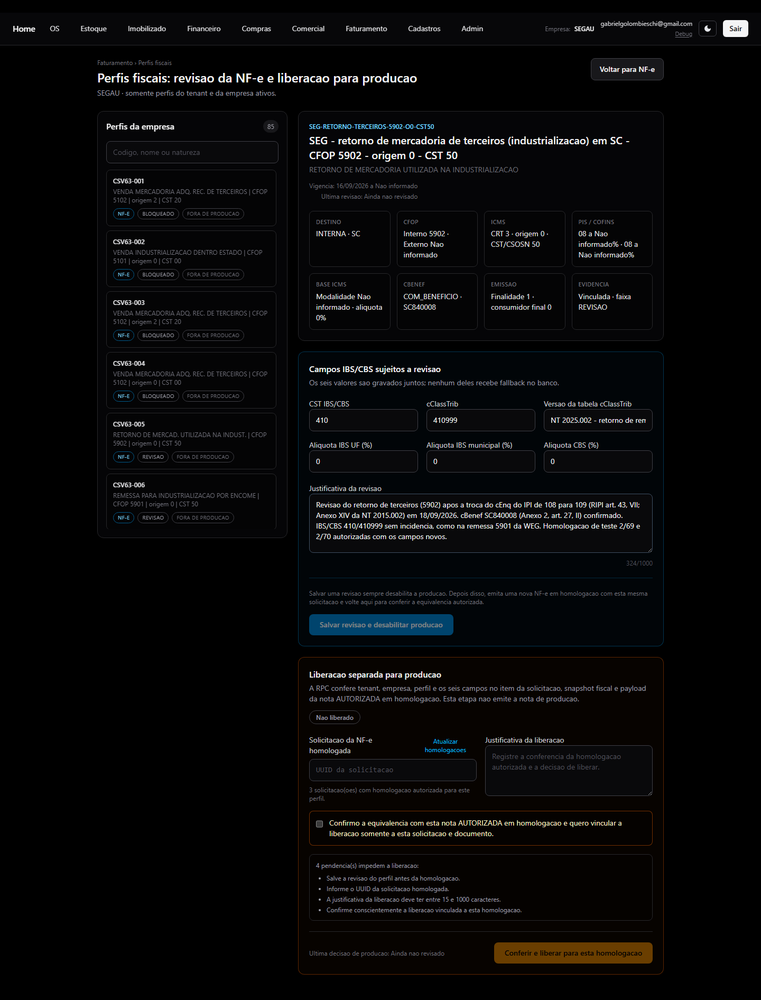

*Revisão do perfil 5902 em 18/09/2026 (só o responsável fiscal): campos IBS/CBS e justificativa preenchidos.*

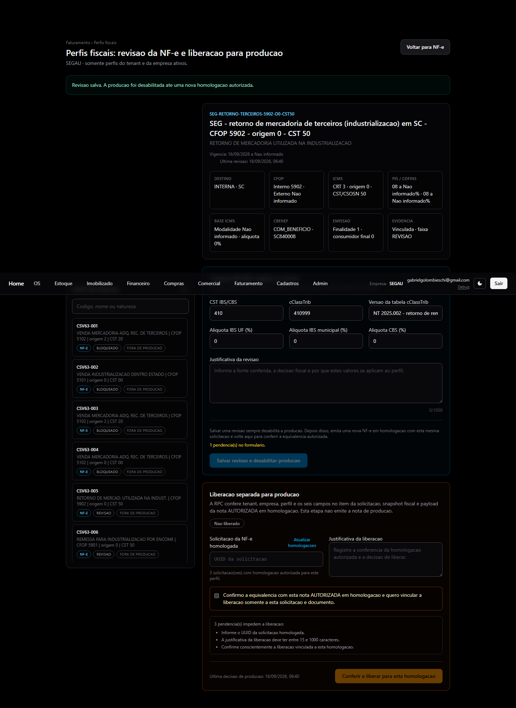

*Perfil 5902 revisado; a produção fica desabilitada até o próximo ensaio + liberação.*

## 7 · Registro desta nota (para a contadora)

| Etapa | Quando | Referência |
| --- | --- | --- |
| Revisão do perfil 5902 (cEnq 109) | 18/09/2026 06:40 | SEG-RETORNO-TERCEIROS-5902-O0-CST50 |
| Importação da remessa | 18/09/2026 06:42 | NF-e 908542/1 · chave 42260760621141000404550010009085421545851279 |
| Ensaio (homologação) | 18/09/2026 06:43 | NF-e 2/71 · protocolo 342260000953956 · solicitação 0fc9a299-dc4d-4a27-a205-a7ca6ce7e581 |
| Liberação do perfil | 18/09/2026 06:44 | vinculada à solicitação acima |
| Nota real | 18/09/2026 06:45 | NF-e 2/25 · chave 42260913671448000189550020000000251536196350 · protocolo 242260442413978 |
| Arquivos | — | DANFE e XML da 2/25 em docs/faturamento/retorno-terceiros-manual/ (repositório) e nos botões da linha |
