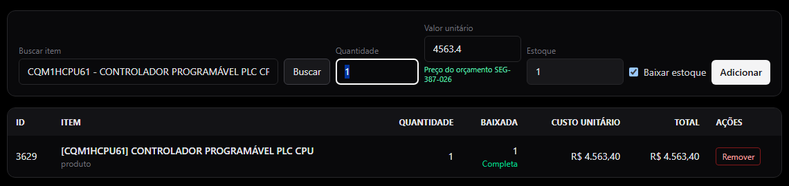
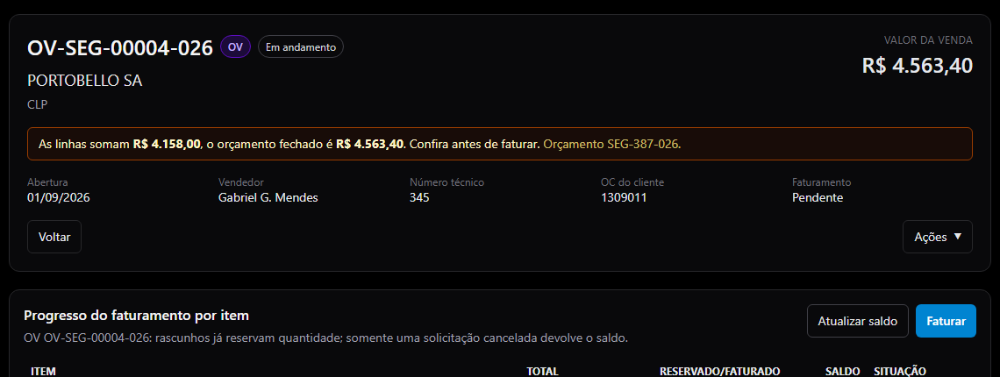
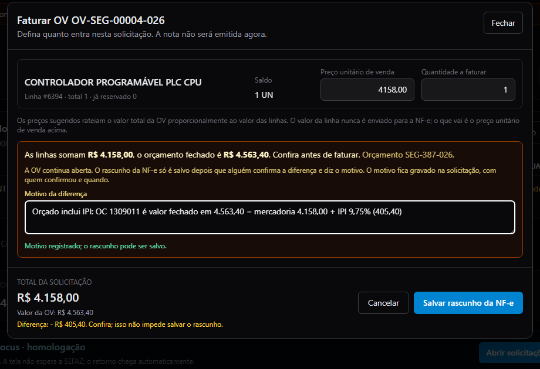
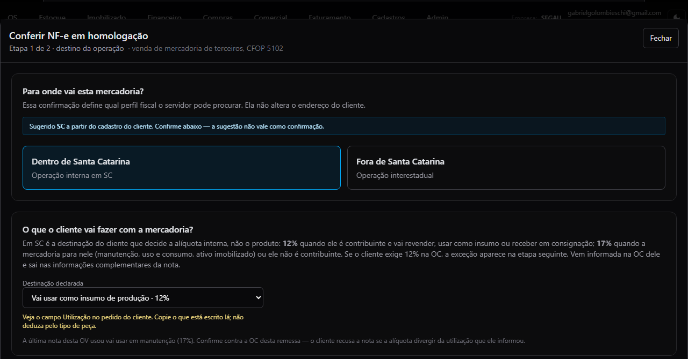
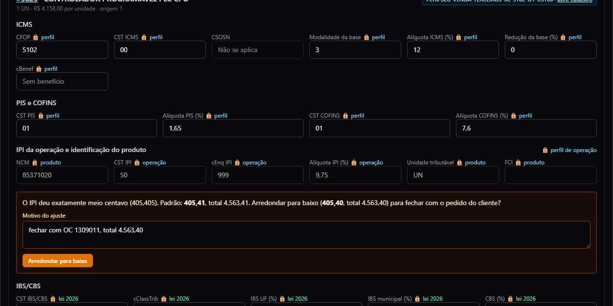
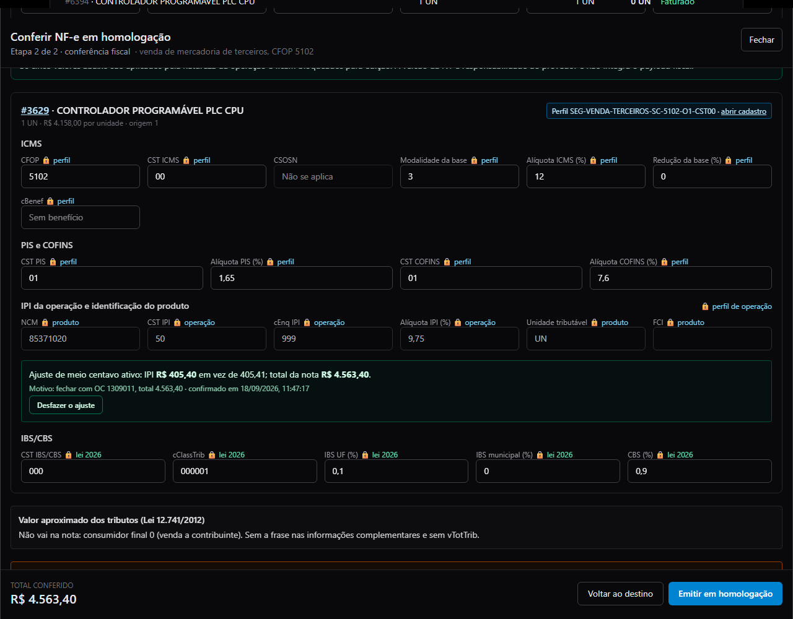
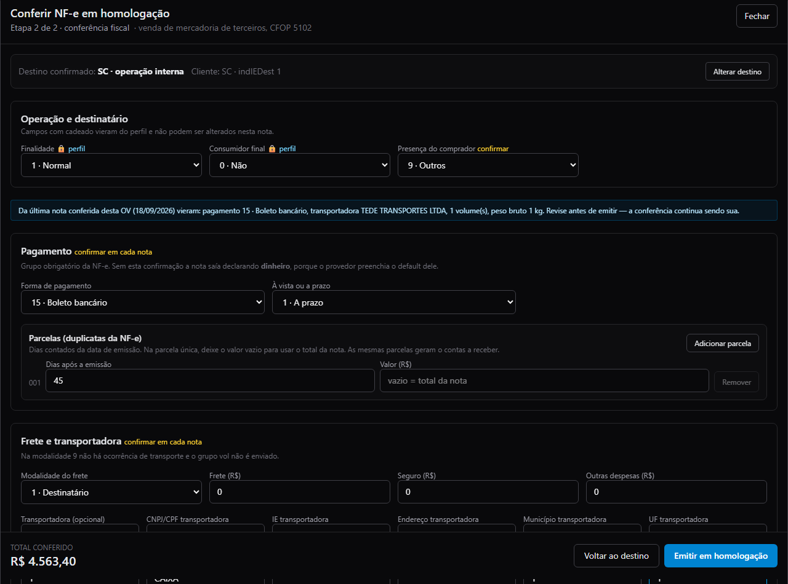
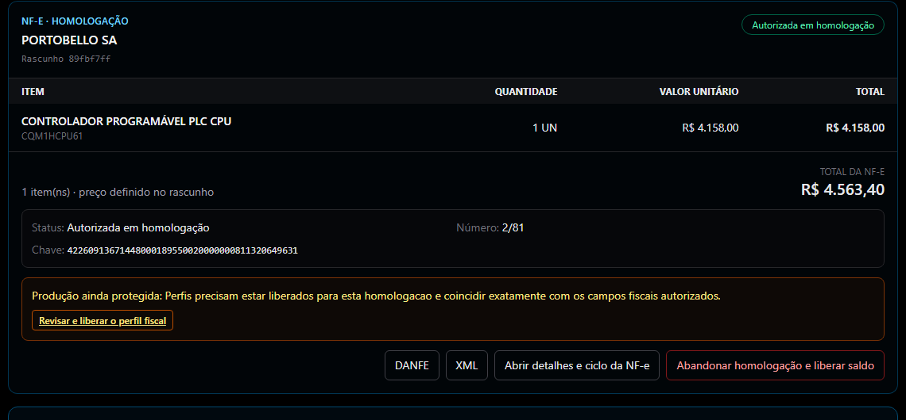
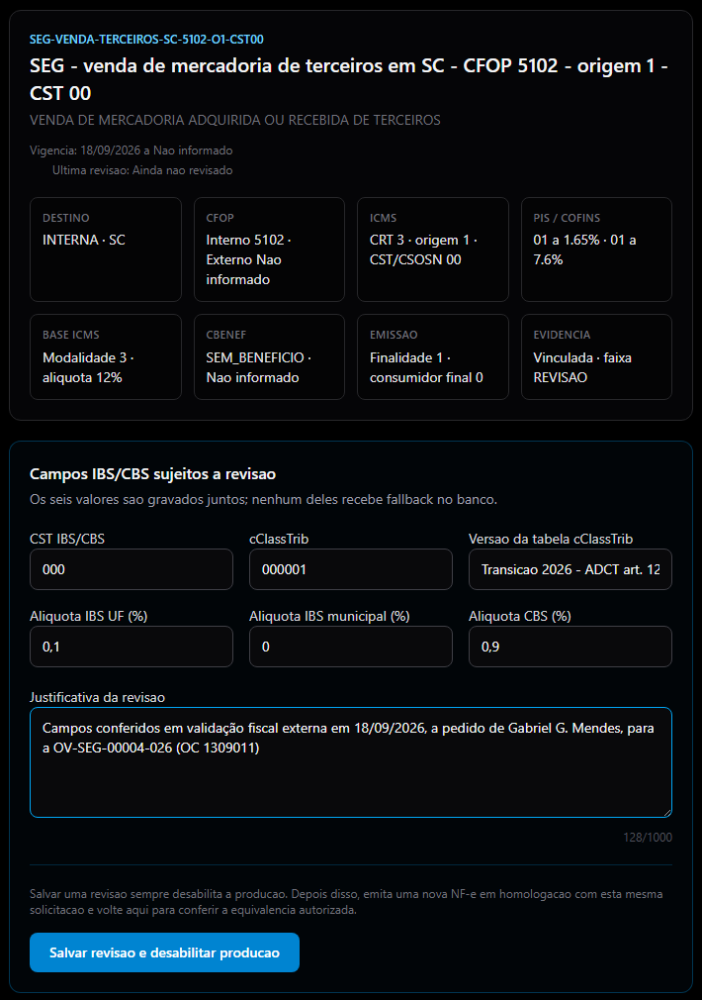
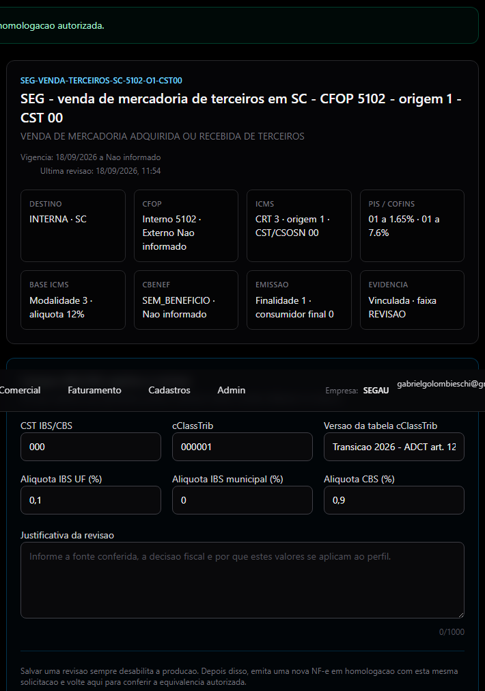

# Vender peça que nós importamos — manual da equipe de faturamento

Onde: **Comercial › Vendas › a OV › aba Faturamento**. Revisado em 18/09/2026 com as telas da OV-SEG-00004-026 (Portobello, CPU de CLP OMRON CQM1H-CPU61 importada pela Segau; ensaio NF-e 2/81 autorizado em homologação). Quem faz: qualquer pessoa com perfil FATURAMENTO, FINANCEIRO ou ADMIN na empresa SEGAU. A emissão real depende de uma liberação do responsável fiscal (capítulo 7).

| Caso de referência | Dados |
| --- | --- |
| Venda | OV-SEG-00004-026 · PORTOBELLO SA (PBG S/A, Tijucas/SC, contribuinte) · orçamento SEG-387-026 · OC 1309011 |
| Peça | CQM1HCPU61 · CONTROLADOR PROGRAMÁVEL PLC CPU · NCM 8537.10.20 · importada pela Segau (DIR 260191366846, NF-e de entrada 2/24) |
| OC do cliente | Valor fechado R$ 4.563,40 **já com o IPI** · Utilização: "Aquisição de Mercadoria Insumos" |
| Nota | Mercadoria 4.158,00 + IPI 9,75% (405,40) = **4.563,40** · ICMS 12% sobre 4.158,00 · CFOP 5102 · origem 1 |
| Ensaio (homologação) | NF-e 2/81 · 18/09/2026 11:55 · autorizada (sem valor fiscal) · chave 42260913671448000189550020000000811320649631 · protocolo 342260000955033 |
| Nota real (produção) | Ainda não emitida: depende de liberar o perfil (capítulo 7) |

## 1 · Quando este manual se aplica

Quando a peça vendida foi **importada pela própria Segau** (a DIR/DI está no nosso CNPJ). Nesse caso a Segau é "equiparada a industrial" e a nota de venda **destaca IPI** mesmo sendo revenda. A peça aparece no cadastro do item, aba fiscal, com **origem 1** e a marca **Importado por nós**. Se a peça foi comprada de um distribuidor no Brasil, este manual não se aplica: a origem é 2 e a nota sai sem IPI.

Duas coisas mudam em relação a uma venda comum: o preço da linha e a conta do IPI. Quando a OC do cliente é **valor fechado** (o total já inclui o IPI), a linha da OV precisa ser a **mercadoria sem o IPI**, para a nota fechar no valor da OC.

> A destinação da nota **vem do campo Utilização da OC do cliente**. Copie o que está escrito lá. Não deduza pelo tipo de peça.

## 2 · O que ter em mãos

- A **OC do cliente**, com o campo **Utilização** (ex.: "Aquisição de Mercadoria Insumos") e o **valor total** (e se ele já inclui o IPI).
- O orçamento fechado (SEG-xxx-026) de onde a OV nasceu: o preço da linha vem dele.
- Confirmação de que a peça está marcada como **Importado por nós** no cadastro (Cadastros › Itens › aba Fiscal). Se não estiver, chame o responsável fiscal antes de começar: sem a marca a nota não sai.
- Quem paga o frete e a transportadora (na Portobello: TEDE, frete por conta do destinatário).

## 3 · Tabela Portobello: Utilização na OC → opção na tela → efeito na nota

| Utilização escrita na OC | Opção na tela ("O que o cliente vai fazer com a mercadoria?") | Efeito |
| --- | --- | --- |
| Insumos | Vai usar como peça/insumo na produção dele | ICMS 12% · IPI **fora** da base do ICMS |
| Revenda | Vai revender | ICMS 12% · IPI fora da base |
| Consignado | Recebe em consignação | ICMS 12% · IPI fora da base |
| Manutenção | Vai usar na manutenção | 17% pela regra; **12% só com a exceção da OC** (etapa seguinte) · IPI **dentro** da base |
| Uso e consumo | Uso e consumo | ICMS 17% · IPI dentro da base |
| Ativo imobilizado | Vai virar equipamento/patrimônio dele (ativo) | ICMS 17% · IPI dentro da base |

"IPI fora da base" quer dizer: o ICMS é calculado só sobre a mercadoria (4.158,00 × 12% = 498,96). "Dentro da base": o ICMS é calculado sobre mercadoria + IPI. O sistema faz a conta; o que você escolhe é a destinação, copiada da OC.

## 4 · Passo a passo

**Passo 1 · Conferir o preço da linha da OV.** Na aba **Itens** da OV, ao incluir a peça, o campo **Valor unitário** já vem com o preço do orçamento (legenda verde "Preço do orçamento SEG-xxx-026"). Se a OC for **valor fechado com IPI**, a linha tem de ser a mercadoria **sem** o IPI: divida o total da OC por 1,0975 (IPI de 9,75%). Ex.: 4.563,40 ÷ 1,0975 = **4.158,00**. Confira a alíquota de IPI do item na aba fiscal do cadastro.

*Aba Itens: o valor unitário vem do orçamento, com a legenda "Preço do orçamento SEG-387-026".*

Quando as linhas não somam o valor da OV, o cabeçalho mostra o aviso **"As linhas somam R$ X, o orçamento fechado é R$ Y. Confira antes de faturar."** Neste caso ele é esperado: o orçado inclui o IPI e a linha não. A OV continua aberta.

*Cabeçalho da OV com o aviso: linhas 4.158,00 × orçado 4.563,40.*

**Passo 2 · Criar o rascunho da NF-e.** Aba **Faturamento** › botão **Faturar**. Preço unitário de venda = o da linha (4.158,00), quantidade = o saldo. Como as linhas diferem do orçado, aparece o quadro laranja pedindo o **motivo da diferença** (15 caracteres ou mais). Escreva: **"Orçado inclui IPI: OC 1309011 é valor fechado em 4.563,40 = mercadoria 4.158,00 + IPI 9,75%"** (troque a OC e os valores). Clique em **Salvar rascunho da NF-e**. Nada é emitido ainda.

*Modal Faturar OV: preço 4.158,00 e o motivo da diferença preenchido.*

**Passo 3 · Destino e destinação.** No cartão do rascunho, clique em **Conferir e emitir em homologação**. Etapa 1: **Dentro de Santa Catarina** (o sistema sugere pela UF do cliente; confirmar é seu clique). Em **Destinação declarada**, escolha a opção que corresponde ao campo **Utilização** da OC, pela tabela do capítulo 3. Na Portobello com "Insumos": **Vai usar como peça/insumo na produção dele · 12%**. Clique em **Continuar para conferência fiscal**.

*Etapa 1: Dentro de Santa Catarina e destinação "Vai usar como peça/insumo na produção dele · 12%", com a legenda "Veja o campo Utilização no pedido do cliente".*

**Passo 4 · Conferência fiscal: o aviso do meio centavo.** O sistema resolve o perfil fiscal (**Perfil SEG-VENDA-TERCEIROS-SC-5102-O1-CST00**) e preenche CFOP 5102, CST 00 a 12%, IPI CST 50 a 9,75%. Se o IPI da linha cair **exatamente em meio centavo** (4.158,00 × 9,75% = 405,405), aparece o quadro laranja: **"O IPI deu exatamente meio centavo (405,405). Padrão: 405,41, total 4.563,41. Arredondar para baixo (405,40, total 4.563,40) para fechar com o pedido do cliente?"** Quando o total da OC é 4.563,40, escreva o motivo (**"fechar com OC 1309011, total 4.563,40"**) e clique em **Arredondar para baixo**. O quadro fica verde com o valor, o motivo e a data, e o **Total conferido** passa a 4.563,40. Se o aviso não aparecer, é porque não há empate: siga em frente.

*Aviso do meio centavo na linha, com o campo de motivo e o botão Arredondar para baixo.*

*Ajuste ativo: IPI 405,40 em vez de 405,41; total da nota 4.563,40; Desfazer o ajuste disponível.*

> Use o ajuste **só** para fechar com o pedido do cliente. Ele muda no máximo R$ 0,01 e fica registrado (motivo, quem, quando). Fora do empate exato o sistema recusa. Se a linha mudar depois, o quadro fica vermelho: desfaça e confirme de novo.

**Passo 5 · Pagamento, frete e emitir o ensaio.** Ainda na conferência: **Presença do comprador 9**; **Forma de pagamento 15 · Boleto**, indicador **1 · A prazo**, parcela 1 com os **dias** da OC (45) e valor em branco (= total); **Modalidade do frete 1 · Destinatário**, transportadora (TEDE TRANSPORTES LTDA, CNPJ 02.484.555/0010-72, R. Gustavo Henschel, Blumenau/SC), frete/seguro/outras 0, **1 volume**, espécie CAIXA, pesos. Confira o **Total conferido = total da OC**. Clique em **Emitir em homologação**.

*Conferência preenchida: boleto a prazo em 45 dias, frete 1 · Destinatário, total conferido 4.563,40 e o botão Emitir em homologação.*

> Homologação é um **ensaio**: a nota vai para o ambiente de teste da SEFAZ e **não tem valor fiscal**. Serve para conferir a nota inteira antes da emissão real.

**Passo 6 · Esperar a resposta e conferir a nota.** A resposta chega sozinha. O cartão passa a **Autorizada em homologação** com o número (2/81), a chave e os botões **DANFE**, **XML** e **Abrir detalhes e ciclo da NF-e**. Confira na DANFE, antes de qualquer coisa, o quadro do capítulo 5. Se aparecer **REJEITADA**, abra o ciclo para ler o motivo e chame o responsável fiscal.

*Cartão do rascunho autorizado em homologação: NF-e 2/81, total 4.563,40 e o link "Revisar e liberar o perfil fiscal".*

## 5 · Conferência final: total da nota = total da OC

Tudo abaixo vem do sistema. Ninguém digita imposto. Se a DANFE mostrar algo diferente, chame o responsável fiscal antes de emitir a real.

| Campo | Valor na 2/81 | Como conferir |
| --- | --- | --- |
| Natureza / CFOP | VENDA MERCADORIA ADQ. REC. DE TERCEIROS / 5102 | Venda de mercadoria de terceiros dentro de SC |
| Item | CQM1HCPU61 · NCM 8537.10.20 · 1 UN × 4.158,00 · **origem 1** | Origem 1 = importação direta (a peça é nossa importação) |
| ICMS | CST 00 · base **4.158,00** · 12% · **498,96** | Insumo/revenda: a base é só a mercadoria |
| IPI | CST 50 · 9,75% · **405,40** | Com o ajuste do meio centavo; sem ele seria 405,41 |
| PIS / COFINS | 01 · base 3.659,04 · 60,37 / 278,09 | Base = mercadoria menos o ICMS |
| IBS / CBS | 000 / 000001 · base 3.320,58 · 3,32 / 29,89 | Transição 2026; sem valor a pagar |
| Consumidor final / xPed | indFinal 0 · pedido 1309011 | Contribuinte que vai usar na produção; a OC vai no pedido |
| **Total da nota** | **4.563,40 = total da OC** | Mercadoria 4.158,00 + IPI 405,40. Se não bater com a OC, pare |
| Cobrança | Boleto (15), a prazo, 1 parcela 001 · 02/11/2026 · 4.563,40 | 45 dias da emissão |
| Frete | 1 · Destinatário · TEDE TRANSPORTES LTDA · 1 volume · 1,000 kg | Como na OC |
| Informações complementares | "Destinação informada pelo destinatário: insumo de produção. Alíquota interna de ICMS de 12% - operação destinada a contribuinte do imposto - Lei 10.297/96, art. 19, III, \"n\", e Lei 17.878/2019 \| Pedido de compra do cliente: 1309011" | Sem texto de exceção: insumo já é 12% pela regra |

## 6 · Mensagens comuns e o que fazer

| O que aparece | O que fazer |
| --- | --- |
| "As linhas somam R$ X, o orçamento fechado é R$ Y. Confira antes de faturar." | Esperado quando a OC inclui o IPI e a linha é a mercadoria. Escreva o motivo no rascunho. Se não for esse o caso, corrija a linha na aba Itens. |
| "Escreva o motivo da diferença" / botão Salvar rascunho travado | O motivo precisa de 15 caracteres ou mais. |
| "origem 1 sem a marca de equiparado a industrial" | A peça está com origem 1 mas sem a marca Importado por nós. Responsável fiscal: Cadastros › Itens › aba Fiscal › Importado por nós (DIR e nota de entrada). |
| "revenda em CFOP 5102 não destaca IPI" | A peça tem IPI no cadastro mas não está marcada como importada por nós. Se foi comprada no Brasil, a origem deve ser 2 e o IPI 53. Responsável fiscal. |
| Aviso do meio centavo | Só quando o IPI cai em empate exato. Arredonde para baixo apenas para fechar com a OC; caso contrário, ignore e emita. |
| "o ajuste de meio centavo está marcado mas o IPI não cai em empate" | A linha mudou depois da confirmação. Clique em Desfazer o ajuste e, se ainda houver empate, confirme de novo. |
| "destinação manutenção exige alíquota interna de 17%" | A OC diz manutenção e o cliente exige 12%: use a exceção da OC (quadro "ICMS 12% por exigência do destinatário", com o número da OC e a evidência). Se a OC diz Insumos, troque a destinação: não é manutenção. |
| Perfil fiscal pendente / "Emissão bloqueada até existir um perfil fiscal válido" | O perfil da operação (origem 1, 5102) não existe ou não cobre esta destinação. Responsável fiscal. |
| Ensaio REJEITADA | Ciclo de vida › ler o motivo › responsável fiscal. Não tente de novo sem saber o motivo. |
| Total da nota diferente do total da OC | Pare. Confira o preço da linha (capítulo 4, passo 1), a destinação e o ajuste do meio centavo. Se persistir, responsável fiscal. |

## 7 · Liberar o perfil e emitir a nota real (responsável fiscal)

A nota real só sai depois que o perfil fiscal usado no ensaio for **revisado** e **liberado para esta homologação**. A revisão do SEG-VENDA-TERCEIROS-SC-5102-O1-CST00 foi salva em 18/09/2026 11:54 (justificativa: campos conferidos em validação fiscal externa a pedido de Gabriel G. Mendes). Falta a liberação, que é decisão do Gabriel. Cliques exatos:

- **1.** Comercial › Vendas › OV-SEG-00004-026 › aba **Faturamento**. No cartão **Autorizada em homologação · NF-e 2/81**, clique em **Revisar e liberar o perfil fiscal**.
- **2.** Abre **Faturamento › Perfis fiscais** já no perfil SEG-VENDA-TERCEIROS-SC-5102-O1-CST00, com a solicitação 89fbf7ff preenchida. Confira o quadro do perfil: destino INTERNA · SC, CFOP interno 5102, CRT 3 · origem 1 · CST 00, PIS/COFINS 01 a 1,65% / 01 a 7,6%, base modalidade 3 · alíquota 12%, sem benefício, finalidade 1 · consumidor final 0, IBS/CBS 000 / 000001 / 0,1 / 0 / 0,9. "Última revisão: 18/09/2026, 11:54". Se algo estiver diferente, **não libere**.
- **3.** Desça até **Liberação separada para produção**. O campo **Solicitação da NF-e homologada** deve mostrar o UUID 89fbf7ff… (se estiver vazio, clique em **Atualizar homologacoes** e escolha a 2/81). Confira que está "posterior à última revisão".
- **4.** Escreva a **Justificativa da liberação** (15 a 1000 caracteres). Sugestão: "Homologação 2/81 conferida: 5102, origem 1, ICMS 12% sobre 4.158,00, IPI 405,40, total 4.563,40 igual à OC 1309011 (Insumos). Liberado para esta solicitação."
- **5.** Marque **"Confirmo a equivalencia com esta nota AUTORIZADA em homologacao e quero vincular a liberacao somente a esta solicitacao e documento."** e clique em **Conferir e liberar para esta homologacao**. A tela volta para a OV.
- **6.** No cartão da 2/81, o aviso "Produção ainda protegida" some e aparece o botão de emissão real. Clique em **Conferir e emitir** de novo: o modal abre em modo **produção** (botão verde **Emitir NF-e real em produção**). Confira o total 4.563,40 e clique. A nota real recebe um número novo da série 2.
- **7.** Depois da autorização: **DANFE** para acompanhar a peça, **XML** para o cliente (botão XML ou Ciclo de vida › enviar por e-mail; a Portobello recusa nota com alíquota diferente da utilização informada na OC). O título a receber nasce com a parcela de 45 dias.

*Tela de perfis: campos do SEG-VENDA-TERCEIROS-SC-5102-O1-CST00 e a justificativa da revisão preenchida (só o responsável fiscal).*

*Revisão salva (Última revisão 18/09/2026, 11:54). A produção fica desabilitada até a liberação por homologação.*

Por que essa etapa existe: a liberação vale **só para esta nota**. Cada venda nova de peça importada passa por ensaio + liberação de novo. É o controle que impede uma nota real sair diferente do que foi conferido.

## 8 · Registro desta nota (para a contadora)

| Etapa | Quando | Referência |
| --- | --- | --- |
| Preço da linha | 18/09/2026 | os_itens 6394: 4.563,40 → 4.158,00 (OC 1309011 valor fechado com IPI); migration 20260918250000 |
| Homologação anterior abandonada | 18/09/2026 11:39 | NF-e 2/73 (manutenção + exceção 12%), solicitação b054ba1c; saldo devolvido |
| Rascunho novo | 18/09/2026 11:40 | Solicitação 89fbf7ff · motivo da diferença gravado (orçado inclui IPI) |
| Ajuste de meio centavo | 18/09/2026 11:47 | IPI 405,405 → 405,40 · motivo "fechar com OC 1309011, total 4.563,40" |
| Revisão do perfil | 18/09/2026 11:54 | SEG-VENDA-TERCEIROS-SC-5102-O1-CST00 · validação fiscal externa a pedido de Gabriel G. Mendes |
| Ensaio (homologação) | 18/09/2026 11:55 | NF-e 2/81 · protocolo 342260000955033 · chave 42260913671448000189550020000000811320649631 |
| Liberação e nota real | — | Pendentes (capítulo 7) |
| Arquivos | — | XML da 2/81 em docs/faturamento/vender-peca-importada-manual/ (repositório) e nos botões do cartão |
